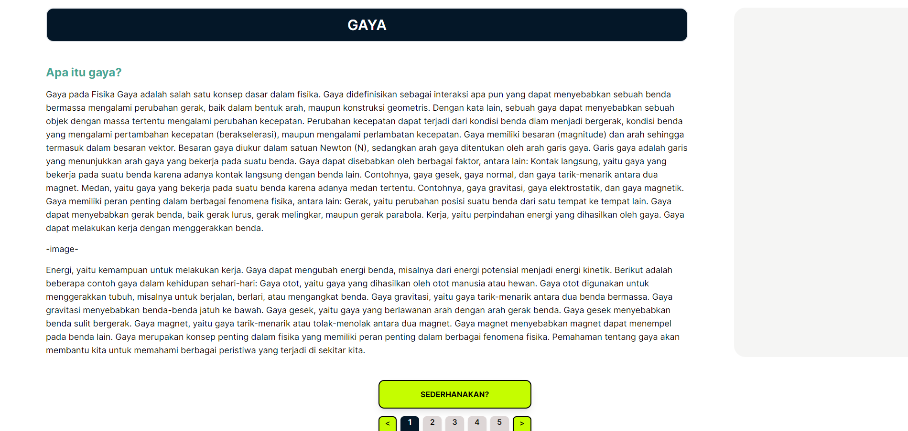
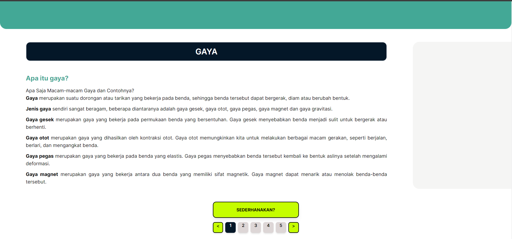

Fitur yang sudah dibuat: penyederhanaan materi dengan gemini ai yang dapat di akses pada route /material dalam folder app/(user)/material/page.js, untuk data materi default sementaramenggunakan dummy

Materi sebelum disederhanakan (generate)

Materi setelah disederhanakan (generate) dengan gemini api

tim: Choose Your Team Name (CYTANE)

Nama Web: Choose Your Learning (CYLEA)
